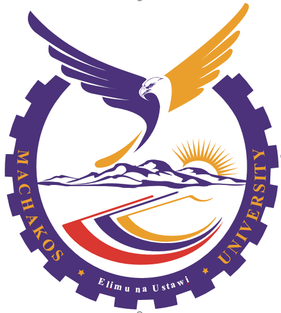
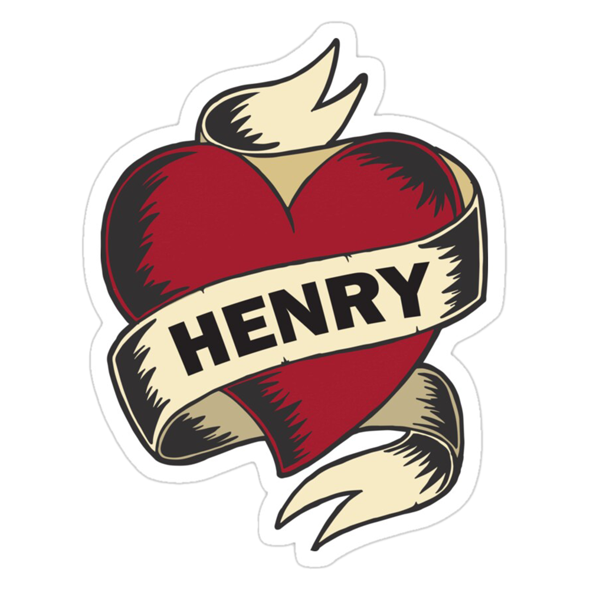

# Hello, I'm Henry Kimani 🇰🇪👋

I'm a software developer from [ Machakos University](https://mksu.ac.ke). I have a passion for developing user experiences, and I love exploring new technologies and building cool projects.

- 🔭 I’m currently working on the [ Milimani High School Platform](https://milimanihighschool.co.ke).
- 🌱 I’m currently learning Java, C++, Machine Learning.
- 👯 I’m looking to collaborate on making life easier through tech.
- 🙃 I’m looking for help with your programming experience.
- 💬 Ask me about anything.
- 👣 check out my [ Potfolio](https://henry.milimanihighschool.co.ke).

## Skills

- Programming Languages: Python, JavaScript, Java, C++, Rust.
- Web Development: HTML/CSS, Django, Flask.
- Machine Learning: Tensorflow, NLTK.
- Data Science: Pandas, NumPy.
- Other: Git.

## GitHub Stats

## Let's Connect

- [ Whatsapp](https://wa.me/+2547057618424)
- [ KimaniHen on X](https://twitter.com/KimaniHen)
- [ Website: Digi-arts](https://henry.milimanihighschool.co.ke)

## Quote

> “I always wanted to be somebody, but now I realise I should have been more specific.” — Lily Tomlin

## Random Facts

Every time you refresh this page, you'll discover something new about me!

  <ul style="list-style-type: none; padding-left: 0;">
    

    <!-- START_RANDOM_FACTS -->
    <!-- END_RANDOM_FACTS -->
  </ul>

  
Feel free to reach out and connect! I'm always open to new opportunities and collaborations. 😊
